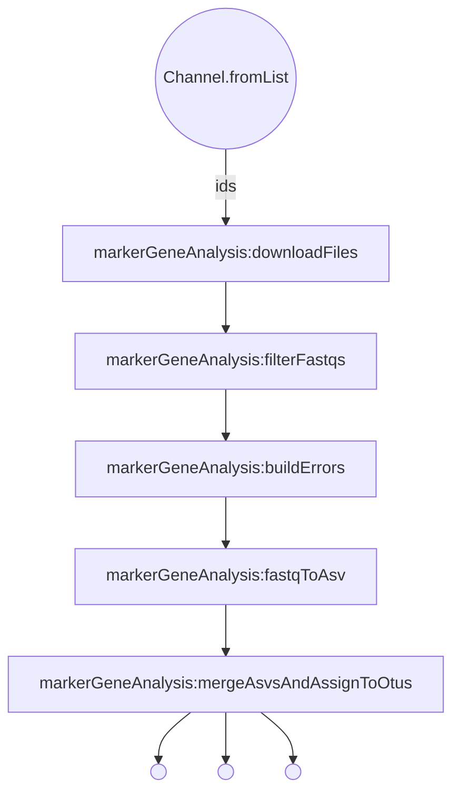

# Nextflow Conversion of ASVTableTask.pm

***
MarkerGeneAnalysis16sDADA2
***  

Decription of nextflow configuration parameters:

| param         | value type        | description  |
| ------------- | ------------- | ------------ |
| studyIdFile | path | Path to SRAID tsv file |
| platform | string | Platform the sequencing was done on. Used in filterFastqs step. Ex: "illumina" |
| isPaired | boolean | Is the data paired? |
| trimLeft | int | Amount to trim from left. Used in filterFastqs step. |
| trimLeftR | int | Amount to trim from reverse strand. Used in filterFastqs step. |
| truncLen | int | Amount to truncate from forward strand. Used in filterFastqs step. |
| truncLenR | int | Amount to truncate from reverse stand. Used in filterFastqs step. |
| maxLen | int | Maximum length. Used in filterFastqs step. |
| mergeTechReps | boolean | Would you like to merge TechReps in fastqToAsv step. |
| trainingSet | path | Path to training set fasta. |
| speciesAssignment | path | Path to species assignment fasta. |
| outputDir | path | Path where you would like results to be stored |
| nValue | scientific notation | Ex: 1e+02 Used in buildErrors Step. Setting value above 1e+02 can cause issues with memory |

In order to run the script, you will need to supply to the nextflow.config file:
1. An apikey to be used to collect the fastq files from NCBI
2. The location of your training set file (a short example file has been supplied in /data)
3. The location of your species assignment file (a short example file has been supplied in /data)

*The parameter names for these have already been specified, you only need to enter them into the empty quotes.*

The output files from this tool will be formatted as (SRRID supplied in sraStudyIDFile parameter)_(outputName parameter).(nothing, "bootstraps", or "full")

### Get Started
  * Install Nextflow
    
    `curl https://get.nextflow.io | bash`
  
  * Run the script
    
    `nextflow run VEuPathDB/MarkerGeneAnalysis16sDADA2 -with-trace -c  <config_file> -r main`

Running this locally can commonly result in an OOME. This results from the derepFastq function in buildErrorsN.R having n as too great a value.

`drpsF[[i]] <- derepFastq(inputFilesF[[i]], n = 1e+06, verbose = verbose)`

The default n is 1 million reads. If an OOME occurs, a lower number can be entered. 

Ex: `drpsF[[i]] <- derepFastq(inputFilesF[[i]],n = 1e+03, verbose = verbose)`

This is specified in the nextflow.config file parameter "nValue". 

Documentation for derepFastq and other dada2 functionality can be found [here](https://rdrr.io/github/benjjneb/dada2/man/derepFastq.html).
